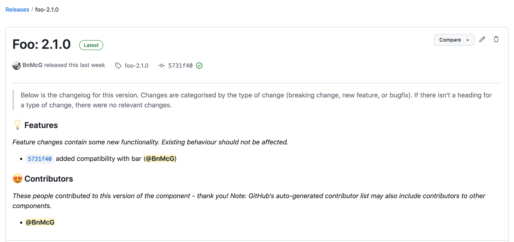

# monorepo-versioning
GitHub Action to generate semantic versions for multiple monorepo components based on the [Conventional Commits specification](https://www.conventionalcommits.org/en/v1.0.0/).

Unlike some other versioning actions, this action makes no assumptions as to the language or ecosystem in use. Instead, it provides a version number which you can use with your package manager, container runtime, etc, of choice.

Versions are tracked using GitHub's "Releases" feature. 

Changelogs are generated automatically and attached to each release.

## Workflow
Consider a monorepo with two components: `A`, and `B`. The repository layout may look like this:

```
- /
  - /a
  - /b
```

It may be desirable to version `A` and `B` separately. If `A` and `B` are two decoupled microservices, changes in `A` may not imply changes in `B`, and therefore incrementing `B`'s version isn't desirable. 

Using a combination of the Conventional Commits specification, and GitHub Releases, this action will maintain separate versions for `A` and `B`. 

When working on `A`, and `B`, include the component that you're changing in the commit's scope. For example, if you were fixing a bug in `A`, then your commit message may look like this:

> fix(a): corrected parsing of enums from strings

Given the following commits:

1. > fix(a): corrected parsing of enums from strings
2. > feat(b): added a new gizmo
3. > refactor(a): split the implementation of foobar into two separate classes
4. > chore(a): fixed a typo

Then when a new version of `B` is generated, only commit #2 will be considered. When a new version of `A` is generated, only commits #1, and #3 will be considered. 

## Versioning behaviour
> TODO: In the future, these rules will be configurable. 

This action maps the following Conventional Commits change types to the specified semantic version bump:

| Change type | Version incremented |
| ----------- | ------------------- |
| Breaking change | Major |
| Feature | Minor |
| Fix | Patch |
| Refactor | Patch |

The same logic applies to versions generated on non-default branches, except
these version numbers will also be marked as pre-release versions, and include a suffix of the shortened commit hash.

## Configuration
To  use this action in your project, specify a workflow configuration like so:

```yaml
---
name: Release Component
on: workflow_dispatch
jobs:
  publish:
    name: Release Component
    runs-on: ubuntu-20.04
    steps:
      - name: Checkout
        uses: actions/checkout@v3

      - name: Generate version
        id: semantic_version
        uses: ellisto/monorepo-versioning@main
        with:
          github-token: ${{ secrets.GITHUB_TOKEN }}
          dry-run: 'no'
          component: 'foo'
          label: 'Foo'
          initial-version: '1.0.0'
          default-branch: master

        - name: Publish Docker image
        if: ${{ steps.semantic_version.outputs.new_version_created == 'yes' }}
        uses: docker/build-push-action@v4
        with:
          push: true
          tags: foo:latest,foo:${{ steps.semantic_version.outputs.version }}
```

The following inputs can be provided:

| Input | Required | Default | Environment Variable | Notes |
| ----- | -------- | ------- | -------------------- | ----- |
| github-token | Yes | "" | `INPUT_GITHUB-TOKEN` | GitHub API token: must have permission to create new releases and tags |
| dry-run | No | "no" | `INPUT_DRY-RUN` | Whether or not to actually create the generated version. Useful for testing. If "no", a version number will be logged, but no GitHub Release will be created |
| component | Yes | "" | `INPUT_COMPONENT` | The component to version. The component is used to track different versions in the monorepo, and must be consistent between releases. Cannot include whitespace, special characters |
| label | No | "" | `INPUT_LABEL` | A human-readable label for the component. This can include whitespace, special characters. If specified, it is used in the changelog in place of the component input value |
| initial-version | No | 1.0.0 | `INPUT_INITIAL-VERSION` | The initial version generated if no previous version exists. You can set this to something other than 1.0.0 if you previously tracked version information using a different method |
| default-branch | No | main | `INPUT_DEFAULT-BRANCH` | The branch to use as the default branch. Versions generated from commits which are not on this branch will be treated as pre-release versions, and include a suffix of the shortened commit hash |

### Running outside of GitHub Actions
> These steps are only necessary when **not** using GitHub Actions.

This action can be used outside of GitHub actions. To do so, pass in the input parameters using the environment variable names specified above. 

**All** of the following additional environment variables are also required:

| Environment Variable | Notes |
| -------------------- | ----- |
| GITHUB_REPOSITORY | The GitHub repository name, specified as owner/repo |
| GITHUB_REF_NAME | The name of the branch or tag from which a version will be generated |
| GITHUB_SHA | The commit SHA of the latest commit. The version will be calculated based on this, and previous, commits. |
| GITHUB_API_URL | The URL of either GitHub.com's API, or your GitHub Enterprise Server API |

## Changelog generation
This action automatically generates a changelog from the commits used to derive the next version. The changes are categorised by type of change, and include the change author.

A summary of contributors to the version is also included.

